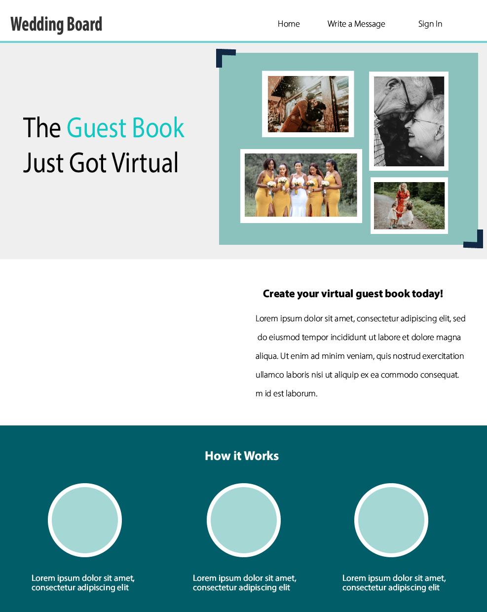
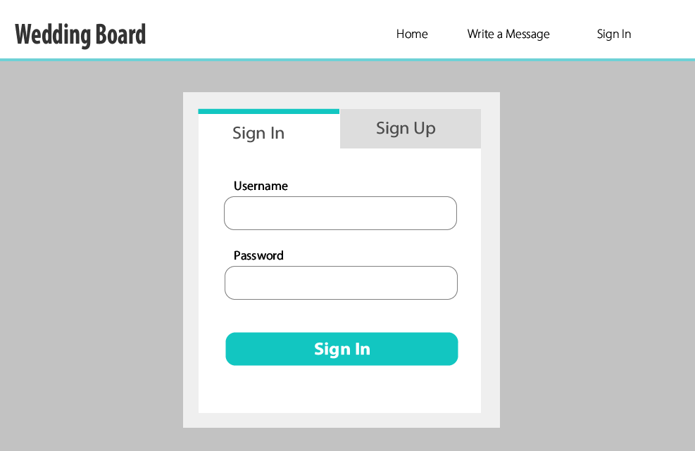
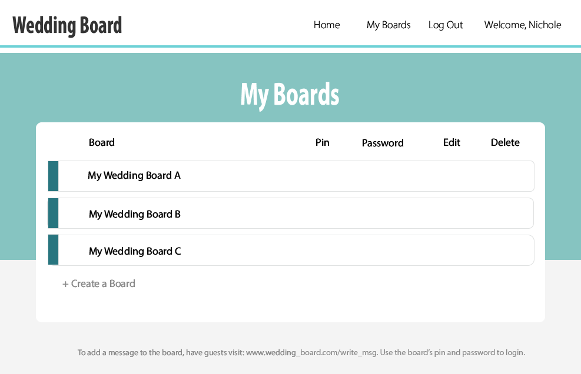
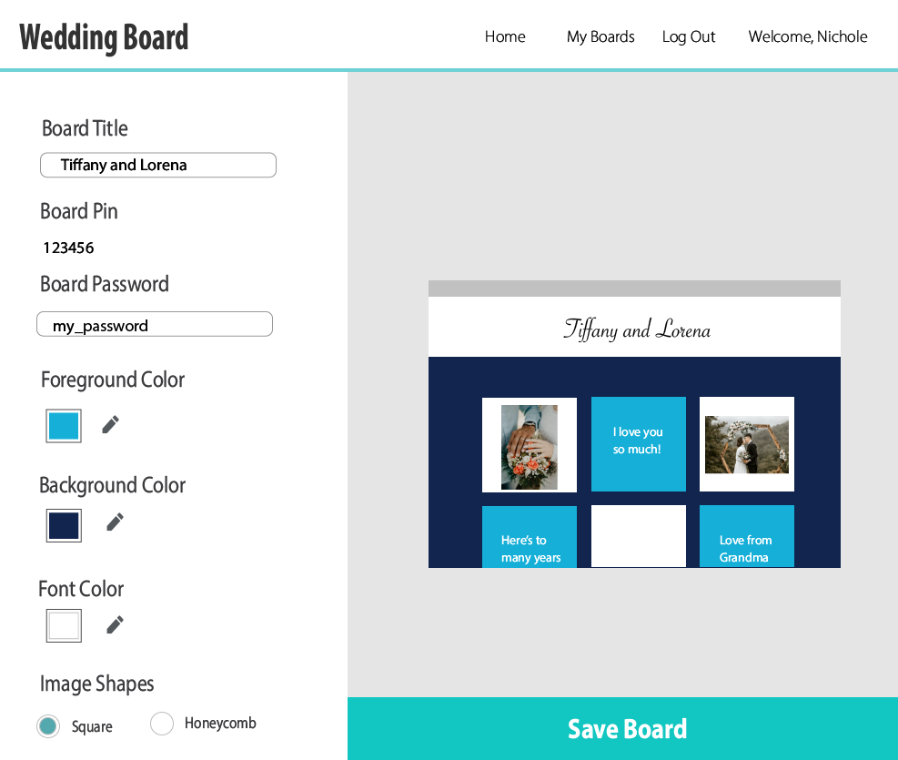

# The Wedding Board

The Wedding Board is a web application that allows a couple to create a virtual guest book for their wedding. Guests attending the wedding can add images with captions to the wedding board. To do so, guests must have the pin and password for the board. All boards will have a randomly generated pin. The couple sets the password for each of their boards.

The following images show the proposed design and flow of the pages that the couple will see when creating their boards:

